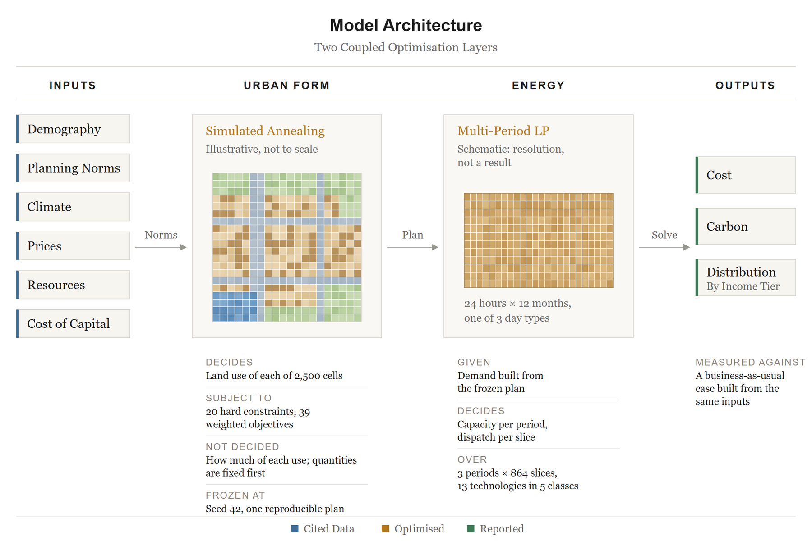
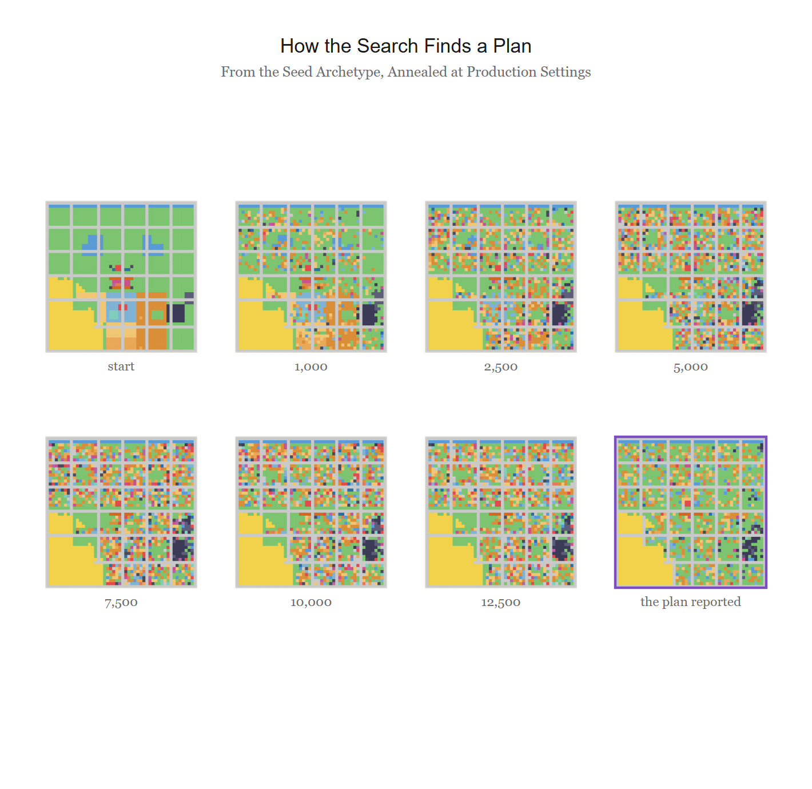
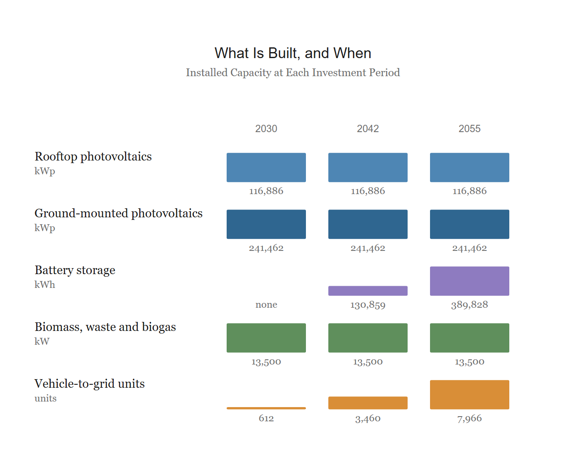
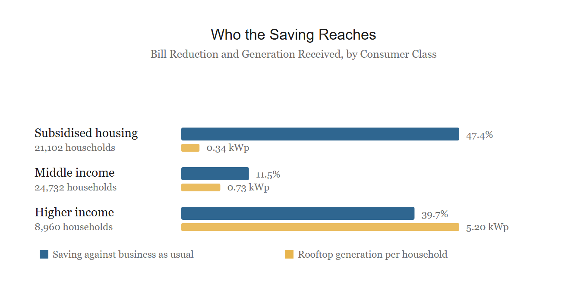
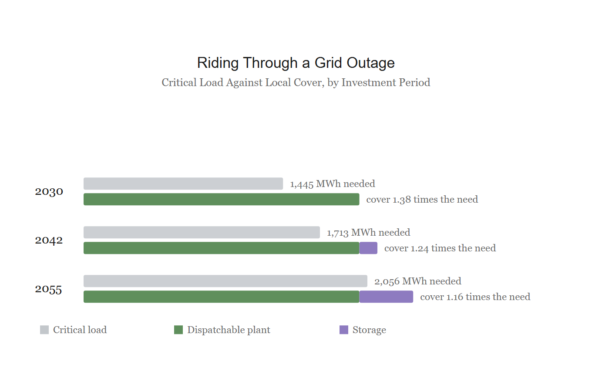
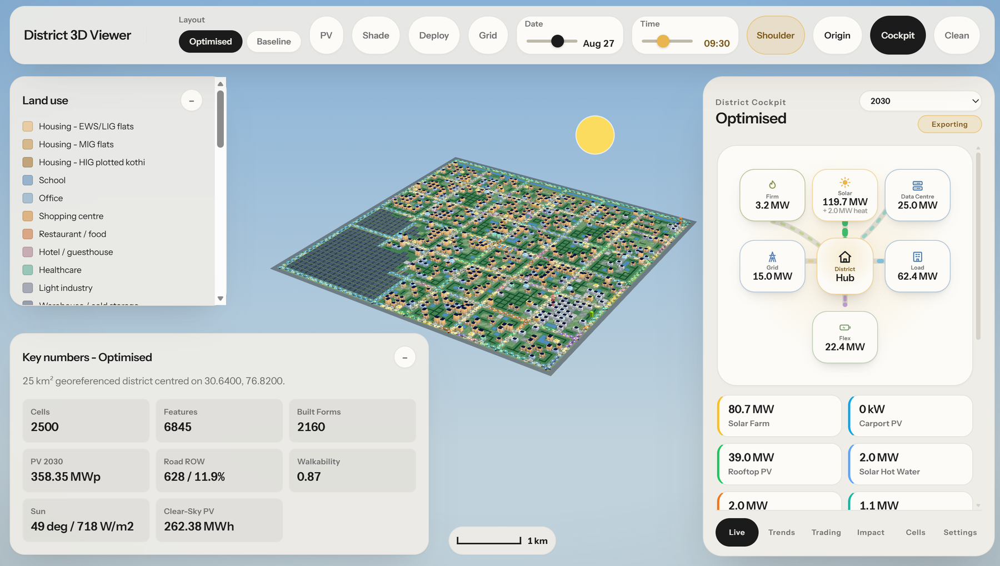
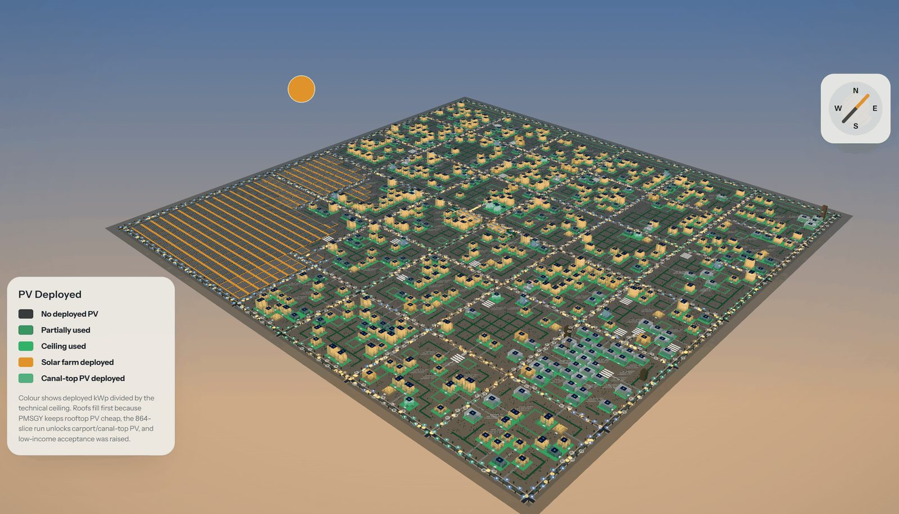
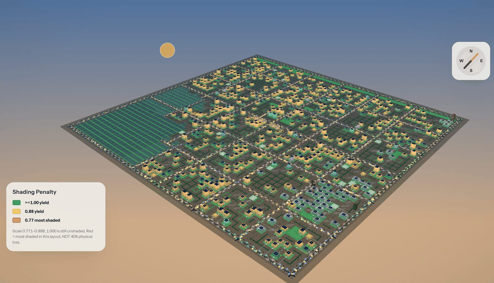
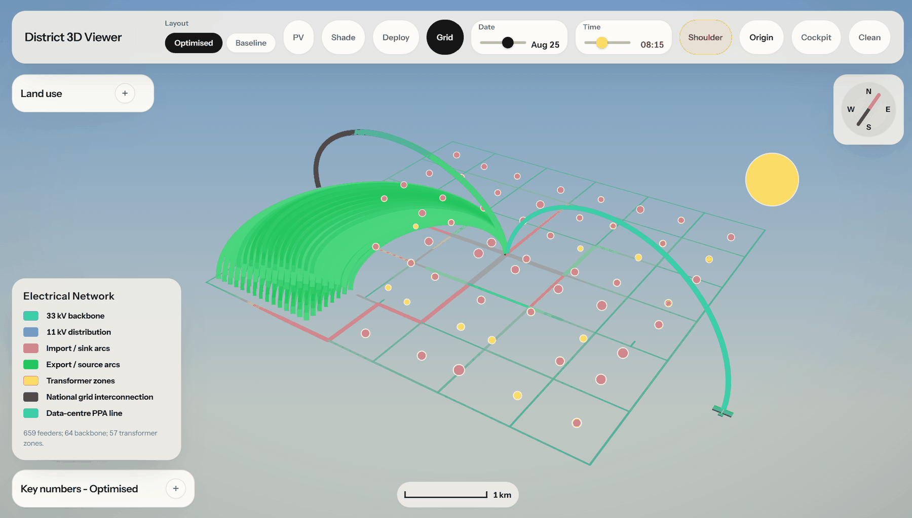
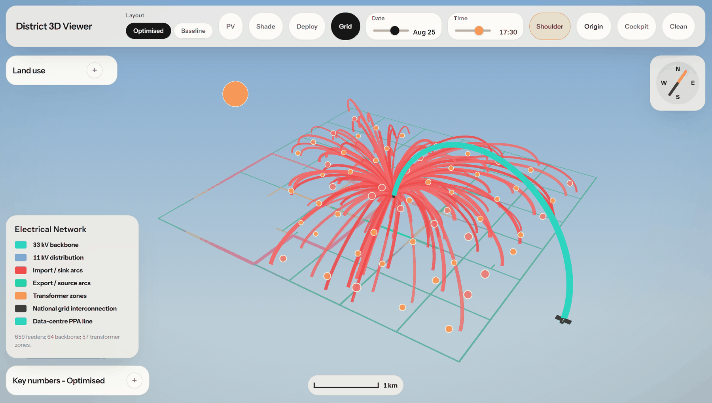

<h1 align="center">Urja district model</h1>

<p align="center">
A model that designs a new town's master plan and its energy system together,<br>
then publishes the result as a 3D viewer and a resident app.
</p>

<p align="center">
<a href="https://urjatown.netlify.app/"><b>3D viewer</b></a> &nbsp;·&nbsp;
<a href="https://urja-home.netlify.app/"><b>Resident app</b></a> &nbsp;·&nbsp;
<a href="PARAMETER_REGISTER.md"><b>Parameter register</b></a>
</p>

<p align="center">


</p>


https://github.com/user-attachments/assets/5c6e9605-9e50-4e3a-a321-51bb1b105e63


*The designed district in the 3D viewer: a full day passes, the energy cockpit re-balances every hour, and the PV, shade and grid layers show what the optimiser saw and what it built.*

---

## What it is

Urja takes a site, a population, statutory planning norms, a climate and a set of tariffs, and produces two things: a land-use plan for a new town, and the energy system that plan should have, sized and operated to 2055. It is demonstrated on a 25 km² greenfield site for 250,000 people on the Zirakpur corridor near Chandigarh, but the site enters only through its data. Change the inputs and the same model designs another district.

The plan and the energy system are designed in one framework because the first decides what the second can be: how much roof there is, which roofs are shaded, and where land is free for generation. Every result is measured against the same town supplied from the grid alone, so the saving is the energy system's and nothing else changes.

<p align="center"></p>

| | Layer 1: the plan | Layer 2: the energy system |
|---|---|---|
| Method | Simulated annealing | Multi-period linear programme, Pyomo with HiGHS |
| Decides | Where each of 2,500 land-use cells goes on a 50 × 50 grid at 100 m | What to build, how much, in which of three periods (2030, 2042, 2055), and how to run it hour by hour |
| Subject to | 20 hard constraints and 39 weighted objectives from planning norms | Supply equals use in each of 864 representative hours: 12 months × 3 day types × 24 hours |
| Does not decide | Quantities. The norms fix how much of everything; the search fixes where | Internal power flow. The district is one bus with aggregate losses |
| Financing | | Each asset at its owner's cost of capital: household, utility, private or pooled |

The two layers share one physics. The sun-path geometry that draws shadows in the viewer is the geometry that derates each roof's PV yield in the optimiser.

---

## Layer 1: the plan

<p align="center"></p>

The search starts from a seeded arrangement and moves cells: swaps, relocations, block moves. Each move is scored against the 20 hard rules (school and healthcare catchments, road connectivity, industry downwind of housing, a limit on one building shading the roof behind it) and the 39 objectives (compactness, solar access, mixed use). Early on some worse moves are accepted; as the schedule cools, only improvements pass. Over 15,000 iterations the objective falls from 152.41 to 20.56. The run is seeded, so the plan is reproducible, and the frozen plan carries a checksum that is verified before and after every energy solve.

---

## Layer 2: the energy system

<p align="center"></p>

Thirteen technology classes are offered: roof- and ground-mounted PV (fixed and tracked), carport and canal-top arrays, building-integrated PV, solar water heating, combined heat and power from biomass, municipal waste and biogas, battery storage, cold and hot-water thermal storage, vehicle-to-grid and demand response. The programme chooses capacity per period and dispatch per hour to minimise system cost over 25 years, with learning curves on capital cost, panel degradation and a decarbonising grid.

What it builds: 116.9 MWp of rooftop and 241.5 MWp of ground-mount PV, all in 2030; 13.5 MW each of biomass, waste and biogas CHP; no battery until 2042, then 131 MWh rising to 390 MWh in 2055; vehicle-to-grid growing from 612 to 7,966 units. Building-integrated PV is offered in every period and never selected. A single-period version of the same model builds no storage and no solar water heating at all.

---

## Results

Against the same plan, the same buildings and the same demand, with every kilowatt-hour bought from the grid:

| Quantity | Designed district | Grid only | Change |
|---|---:|---:|---:|
| Annual energy-system cost, design year | ₹1.73 bn | ₹3.64 bn | **-52.4%** |
| Annual CO₂, operational plus embodied | 118.2 kt | 311.1 kt | **-62.0%** |
| Lifetime cost, 25 years | ₹62.55 bn | ₹110.07 bn | **-43.2%** |
| Cumulative CO₂, 25 years | 2.16 Mt | 5.52 Mt | **-61.0%** |
| Grid connection required | 145 MW | 210 MW | **-31%** |
| Renewable share, self-generated only | 79.3% | 0% | |
| Net system cost per kWh served | ₹3.29 | ₹6.86 | |

| | |
|---|---|
|  |  |
| **Who saves.** Bills are allocated after the solve, so subsidy never distorts the engineering. Subsidised housing saves 47% through a social tariff, higher-income households 40% through rooftops they own, and the middle only 11%, because neither instrument reaches them. | **Resilience.** The finished system is tested hour by hour through a month with no grid imports. Local plant and storage cover the critical load 1.38 times over in 2030, 1.24 in 2042 and 1.16 in 2055. |

Two further findings shaped the design. Releasing reserved public land for generation at the outset is worth 8.1% of annual cost, while rearranging a settled plan is worth 0.44%: the plan's largest energy effect is what the land can hold, not where things sit. And Punjab averages 3 to 5 m/s of wind, under the threshold for utility turbines, so the model carries no wind.

---

## The 3D viewer

Built in deck.gl and WebGL. It reads the model's output files and recomputes nothing. Live at [urjatown.netlify.app](https://urjatown.netlify.app/).

<p align="center"></p>

| | |
|---|---|
|  |  |
| *Deploy layer: where the optimiser put PV. Roofs first, then carports and the farm.* | *Shade layer: roofs that lose output to a taller neighbour, and by how much.* |
|  |  |
| *Grid layer at 08:15: green arcs, the district is exporting.* | *Grid layer at 17:30: red arcs, the evening peak, the district is importing.* |

---

## The resident app

The same results seen from one household. Pick a block and one of its homes: what it is drawing now, its roof, today's bill, hour by hour. Live at [urja-home.netlify.app](https://urja-home.netlify.app/).

<div align="center">
https://github.com/user-attachments/assets/c93626cf-1897-45b9-9de2-c44a901f0638
<div >


---

## What is here

| | |
|---|---|
| `core/` | entities, land use, buildings, the initialisation chain |
| `layout/` | the simulated-annealing layout optimiser and its metrics |
| `energy/` | the multi-period LP: costs, dispatch, network, storage |
| `scripts/` | derivations, audits and the register generator |
| `tests/` | the test suite, 188 tests |
| `config/` | the six configuration files the model reads |
| `viewer3d/` | the 3D viewer, source only |
| `app/` | the resident app, source only |
| `PARAMETER_REGISTER.md` | all 1,441 parameters with value, units and source |
| `docs/media/` | the figures on this page |

### Parameters and sources

Every one of the 1,441 parameters is registered by a generator, never by hand, so the register cannot drift from what the model computes. A source is attached only where that parameter's own entry names one; 411 carry a direct source link. Where no external source applies, the register says which kind of value it is instead: a switch, shares that sum to one, model structure, a derived value with its derivation beside it, a bound, or a design choice. A value that could not be sourced is reported as unsourced rather than given a plausible citation.

```bash
python scripts/appendix_c_parameters.py
```

### Running it

Python 3.9 or later, with Pyomo and the HiGHS solver:

```bash
pip install pyomo highspy numpy pyyaml
```

The solved outputs are not in this repository. The two live applications are built from them and are the easiest way to see what the model produces.

---

## Licence

No licence is granted. The code is published so that the model and its results can be checked, not for reuse. All rights reserved.

<p align="center"><sub>Aryan Bansal · 2025 to 2026</sub></p>
